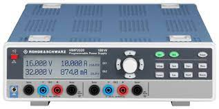

<div id="top"></div>

<!-- PROJECT SHIELDS -->
<!--
*** I'm using markdown "reference style" links for readability.
*** Reference links are enclosed in brackets [ ] instead of parentheses ( ).
*** See the bottom of this document for the declaration of the reference variables
*** for contributors-url, forks-url, etc. This is an optional, concise syntax you may use.
*** https://www.markdownguide.org/basic-syntax/#reference-style-links

[![Contributors][contributors-shield]][contributors-url]
[![Forks][forks-shield]][forks-url]
[![Stargazers][stars-shield]][stars-url]
[![Issues][issues-shield]][issues-url]
[![LinkedIn][linkedin-shield]][linkedin-url]
-->

[![MIT License][license-shield]][license-url]

<!-- PROJECT LOGO -->
<div align="center">
  <a href="https://github.com/othneildrew/Best-README-Template"></a>
  <h3 align="center">Rohde&Schwarz HMP2020 Series Remote Control with Go</h3>
  <p align="center"> Use USB Virtual Com Port for switching the Power Supply</p>
</div>

<!-- TABLE OF CONTENTS -->
<details>
  <summary>Table of Contents</summary>

<!-- vscode-markdown-toc -->

- [1. About The Project](#1-about-the-project)
- [2. Usage](#2-usage)
- [General Information](#general-information)
  - [Stepping Example](#stepping-example)
  - [Arbitrary Example](#arbitrary-example)
- [3. License](#3-license)

<!-- vscode-markdown-toc-config
	numbering=true
	autoSave=true
	/vscode-markdown-toc-config -->
<!-- /vscode-markdown-toc -->

  </ol>
</details>

<!-- ABOUT THE PROJECT -->
##  1. <a name='AboutTheProject'></a>About The Project

This package provides a Go package you can use for HMP2020 remote control.

<p align="right">(<a href="#top">back to top</a>)</p>

##  2. <a name='Usage'></a>Usage

You can use the demo app, the **hmp** executable, in this way without building the software to generate power cycles for testing:

```bash
hmp -p com7 -ch 2 -V 24 -mA 1000 -msON 5000 -msOFF 1000 -v
```

* Uses COM port 7 (as example)
* Control channel 2
* Set channel to 24 Volt output voltage.
* Set channel to 1000 mA max current.
* Start endless loop:
  * Switch channel ON for 5 seconds.
  * Switch channel OFF for 1 second.
* Show all commands and measured values.

## General Information

* All HPM series devices support similar SCPI command as long as the functionality is equal.
* All NG series devices support similar SCPI command as long as the functionality is equal.
* Basic commands for setting and reading voltage and current and enabling/disabling the output are equal for all devices.
* The HMP does not support SCPI command concatenation with ";". Each command needs to be transmitted separately.
* Step commands are executed as they occur as long the max and min values are not exceeded.

### Stepping Example

```bash
INST OUT1  // Instrument output 1
VOLT 
VOLT:STEP 0.4 // step size 400 mV
VOLT UP    // step up
VOLT UP    // step up
...
VOLT UP    // step up
VOLT DOWN  // step down
VOLT DOWN  // step down
...
VOLT DOWN  // step down
...
```

### Arbitrary Example

* It is important to delete the old curve.
* The EasyArb inside HMP supports max 128 points.
* Max 255 repetitions are possible. Higher numbers accepted without error message, but only 255 are executed.
* Time resolution and min duration is 10 ms.

```bash
ARB:CLEAR 2                        // clear channel 2
ARB:DATA 12.0,1.0,0.1,6.0,2.0,0.05 // 2 Points: 12V@1A & 100ms then 6V@2A & 50ms
ARB:REP 100                        // 100 repetitions
ARB:TRAN 2
ARB:STAR 2                         // start channel 2
OUTP ON                            // enable output

```
<!-- LICENSE -->
##  3. <a name='License'></a>License

Distributed under the MIT License. See `LICENSE.txt` for more information.

<p align="right">(<a href="#top">back to top</a>)</p>

<!-- MARKDOWN LINKS & IMAGES -->
<!-- https://www.markdownguide.org/basic-syntax/#reference-style-links -->
[contributors-shield]: https://img.shields.io/github/contributors/othneildrew/Best-README-Template.svg?style=for-the-badge
[contributors-url]: https://github.com/othneildrew/Best-README-Template/graphs/contributors
[forks-shield]: https://img.shields.io/github/forks/othneildrew/Best-README-Template.svg?style=for-the-badge
[forks-url]: https://github.com/othneildrew/Best-README-Template/network/members
[stars-shield]: https://img.shields.io/github/stars/othneildrew/Best-README-Template.svg?style=for-the-badge
[stars-url]: https://github.com/othneildrew/Best-README-Template/stargazers
[issues-shield]: https://img.shields.io/github/issues/othneildrew/Best-README-Template.svg?style=for-the-badge
[issues-url]: https://github.com/othneildrew/Best-README-Template/issues
[license-shield]: https://img.shields.io/github/license/othneildrew/Best-README-Template.svg?style=for-the-badge
[license-url]: https://github.com/othneildrew/Best-README-Template/blob/master/LICENSE.txt
[linkedin-shield]: https://img.shields.io/badge/-LinkedIn-black.svg?style=for-the-badge&logo=linkedin&colorB=555
[linkedin-url]: https://linkedin.com/in/othneildrew
[product-screenshot]: images/screenshot.png
